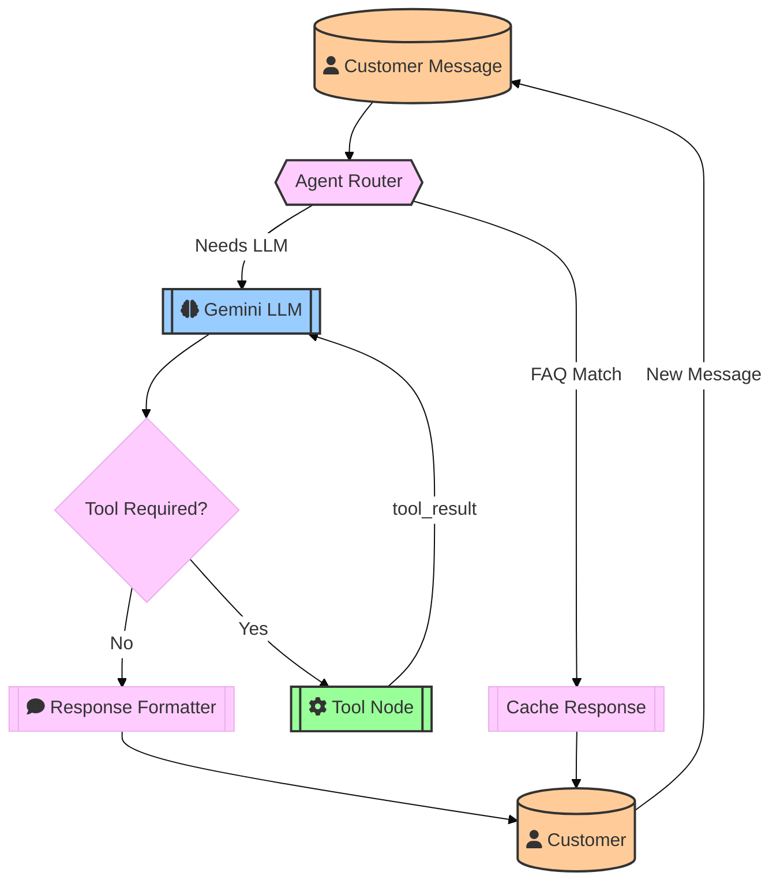

# in every product need to save FAQ
# count number of token, save to db, per business user

I want to get a architechture from you... just give me the graph with description
businessman some products, services. have brand_persona. and some FAQ . here cutomer sent message to the website , agent decite the message sent   to llm(gemini) , then gemini reply to agent , agent give reply to customer or used tool then call llm again , llm reply, .call tool or reply user ... continue, i will use lang graph . just give the visualization with proper description

```plaintext

┌───────────────────────────────────────────────────────────────────────┐
│                            LANGGRAPH WORKFLOW                         │
├───────────────────┬───────────────────┬───────────────────┬───────────┤
│    AGENT ROUTER   │     LLM NODE      │    TOOL NODE      │ RESPONSE  │
│   (Decision Hub)  │    (Gemini)       │  (API Actions)    │ FORMATTER │
├─────────┬─────────┼─────────┬─────────┼─────────┬─────────┼───────────┤
│ Input:  │  FAQ    │ Input:  │ Needs   │ Input:  │ Tool    │ Input:    │
│ Message │ Match?  │ Message │ Tool?   │ Tool    │ Result  │ LLM/FAQ   │
│         │         │ +       │         │ Request │         │ Output    │
│         │         │ Context │         │         │         │           │
├─────────┴────┬────┴────┬────┴────┬────┴────┬────┴────┬────┴────┬──────┤
│              │         │         │         │         │         │      │
│  Yes ────────┘         │ No ─────┘         │         │         │      │
│                        │                   │         │         │      │
│  No                    │ Yes               │         │         │      │
│                        │                   │         │         │      │
│  ▼                     ▼                   ▼         ▼         ▼      │
│  ┌───────────────────────────────────────────────────────────────┐   │
│  │                         STATE OBJECT                          │   │
│  ├───────────────────────────────────────────────────────────────┤   │
│  │ {                                                            │   │
│  │   "message": "Order status?",                                │   │
│  │   "needs_tool": True,                                        │   │
│  │   "tool_name": "order_api",                                  │   │
│  │   "tool_args": {"order_id": 123},                            │   │
│  │   "llm_output": null,                                        │   │
│  │   "tool_result": {"status": "shipped"}                       │   │
│  │ }                                                            │   │
│  └───────────────────────────────────────────────────────────────┘   │
└───────────────────────────────────────────────────────────────────────┘

FLOW EXPLANATION:
1. Customer Message → Agent Router
   ├─ FAQ Match → Response Formatter → Customer
   └─ Needs LLM → LLM Node
       ├─ No Tools → Response Formatter → Customer
       └─ Needs Tool → Tool Node → (Update State) → LLM Node → ...
```
---


