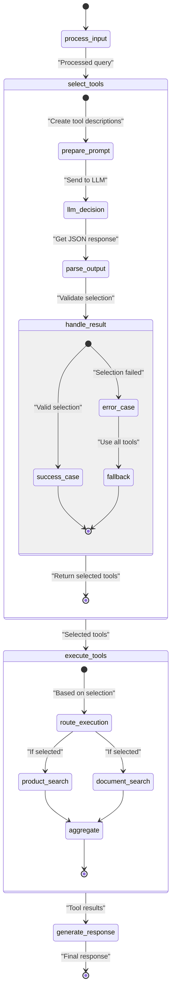
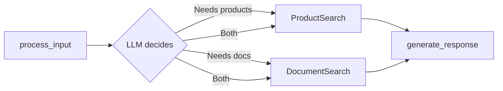
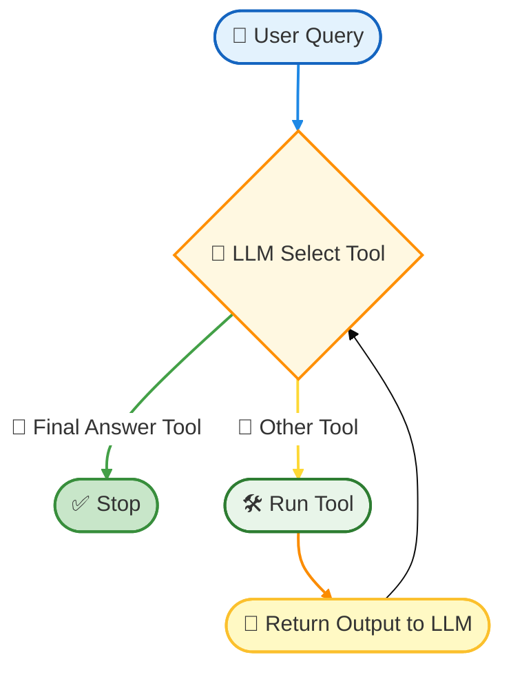

```plaintext

┌───────────────────────────────────────────────────────────────────────────────┐
│                                                                               │
│                            CUSTOMER MESSAGE FLOW                              │
│                                                                               │
└───────────────────┬───────────────────────────────────────────┬───────────────┘
                    │                                           │
                    v                                           v
┌─────────────────────────────────┐                 ┌───────────────────────────┐
│                                 │                 │                           │
│      POSTGRESQL DATABASE        │                 │      AGENT DECISION       │
│                                 │                 │                           │
│ ┌─────────────────────────────┐ │                 │ 1. Analyze message        │
│ │                             │ │                 │ 2. Decide:                │
│ │        Conversation         │ │                 │    - Direct reply?       │
│ │                             │ │                 │    - Need LLM?            │
│ └─────────────────────────────┘ │                 │    - Need tool?           │
│                                 │                 │                           │
│ ┌─────────────────────────────┐ │                 └──────────────┬────────────┘
│ │                             │ │                                │
│ │        ChatMessage          │ │                                │
│ │                             │ │                                v
│ └─────────────────────────────┘ │                 ┌───────────────────────────┐
│                                 │                 │                           │
└─────────────────────────────────┘                 │        TOOL CALL          │
                                                    │                           │
                                                    │ (External APIs/services   │
                                                    │  for specific tasks)      │
                                                    │                           │
                                                    └──────────────┬────────────┘
                                                                   │
                                                                   v
┌───────────────────────────────────────────────────────────────────────────────┐
│                                                                               │
│                              LLM (Gemini) INTERACTION                         │
│                                                                               │
│ ┌─────────────────────────────────────────────────────────────────────────┐  │
│ │                                                                         │  │
│ │  Context:                                                               │  │
│ │  - Current conversation history                                         │  │
│ │  - Brand persona                                                       │  │
│ │  - Products/Services info                                              │  │
│ │  - FAQ knowledge                                                       │  │
│ │                                                                         │  │
│ └─────────────────────────────────────────────────────────────────────────┘  │
│                                                                               │
│                                                                               │
│ 1. Agent sends message + context to Gemini                                   │
│ 2. Gemini generates response or requests tool usage                          │
│ 3. Process continues until final response is ready                           │
│                                                                               │
└───────────────────────────────────┬───────────────────────────────────────────┘
                                    │
                                    v
┌───────────────────────────────────────────────────────────────────────────────┐
│                                                                               │
│                            RESPONSE TO CUSTOMER                               │
│                                                                               │
│ 1. Final response stored in DB                                                │
│ 2. Sent back through original channel                                        │
│                                                                               │
└───────────────────────────────────────────────────────────────────────────────┘
```





```mermaid
stateDiagram-v2
    [*] --> process_input
    process_input --> select_tools: "user_query"
    select_tools --> execute_tools: "selected_tools"
    execute_tools --> generate_response: "tool_results"
    generate_response --> [*]
    
    state select_tools {
        [*] --> gemini_prompt: "Create numbered tool list"
        gemini_prompt --> get_response: "Send to Gemini"
        get_response --> parse_json: "Extract tool numbers"
        parse_json --> map_tools: "Convert numbers to tools"
        map_tools --> [*]: "Return selected tools"
        
        state error_handling {
            [*] --> parse_error: "If JSON invalid"
            parse_error --> fallback: "Use all tools"
            fallback --> [*]
        }
    }
    
    state execute_tools {
        [*] --> check_selection: "Verify tools"
        check_selection --> run_sequential: "Run selected tools"
        run_sequential --> aggregate: "Collect results"
        aggregate --> [*]
    }
````

```mermaid
%%{init: {'theme': 'base', 'themeVariables': { 'primaryColor': '#e3f2fd'}}}%%
graph LR
    A[Customer Message] --> B[Agent Executor]
    B --> C{LLM Tool Selection}
    C -->|"ProductSearch"| D[Execute Product Tool]
    C -->|"No tools"| E{LLM Response Generator}
    D --> E
    E --> F[Final Answer]
    
    style C fill:#fff8e1,stroke:#ffc107
    style E fill:#fff3e0,stroke:#ffa000
    linkStyle 1 stroke:#9e9e9e,stroke-width:2px
```




#  Why Use KV Caching?
i have to know how to enable caching in gemini and chatgpt model
- Cost saving: Don’t reprocess repeated context.

- Speed: Significantly faster inference.

- Ideal for: Multi-turn chat, long documents, LangGraph loops.